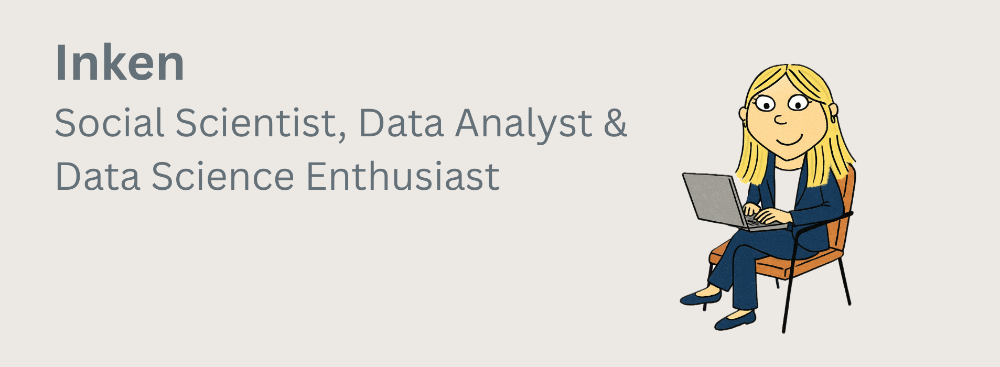

# Hi, I'm Inken 👋

I am a **Social Scientist** and an **experienced Data Analyst** with a strong background in data collection, preparation, and analysis.  
Currently, I am expanding my methodological expertise in **Machine Learning** and advanced analytics.  

---

## 🎓 Background
- 🎓 Master's degree in Political Science  
- 💼 4 years of professional experience in academic research  
- 📊 Specialized in survey design, data analysis, and reporting  
- 🤝 Experienced in project management and interdisciplinary collaboration  

---

## 🛠️ Skills & Tools
- **Programming & Data Science**: Python (NumPy, Pandas, Scikit-learn, Keras), R, SQL, PHP, Stata  
- **Project Management**: Planning, coordination, and execution of interdisciplinary projects  
- **Other**: Microsoft Office, Scientific Publications, Stakeholder Communication  

---

## 📌 Selected Experience
- Conducted **large-scale data collection** and survey programming for academic projects  
- Applied **regression analysis with Stata** and advanced text analysis with **R** (STM, NLP)  
- Designed and implemented **online surveys and experiments** using PHP   
- Developed **research designs, questionnaires, and scientific publications**   

---

## 🚀 Current Focus
I am currently enhancing my skills in **Machine Learning** and **applied Data Science**.  

---

## 📂 Featured Projects
🔹 [**Stroke Risk Prediction (Machine Learning)**](https://github.com/InkenOk/stroke-risk-prediction-ml)  
This project analyzes patient data (Kaggle dataset) to predict **stroke risk**.  
The goal is to develop an early warning system that detects strokes as reliably as possible.

🔹 [**Financial News Analysis**](https://github.com/InkenOk/Finanznachrichten-Analyse)  
This project investigates how the **sentiment of financial news** (positive, neutral, negative) affects the **short-term stock price movement** of five major German companies.  

---

## 📫 Get in Touch
- ✉️ [Email](mailto:inken.okrug@gmail.com)

---

⭐️ Feel free to explore my repositories and connect with me!
